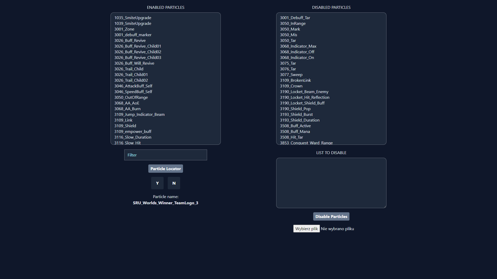
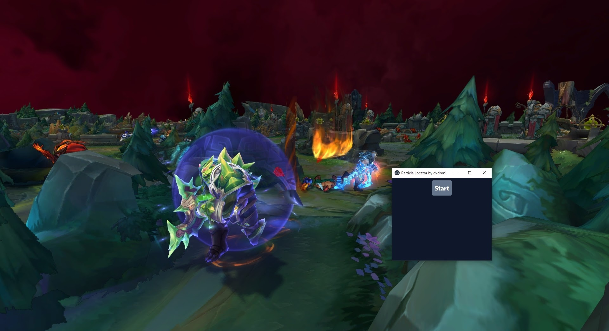
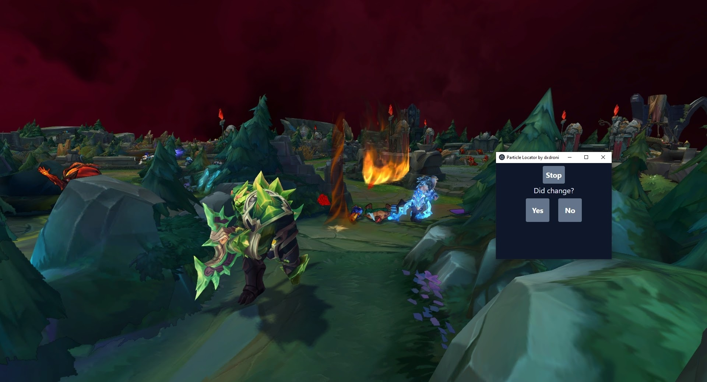
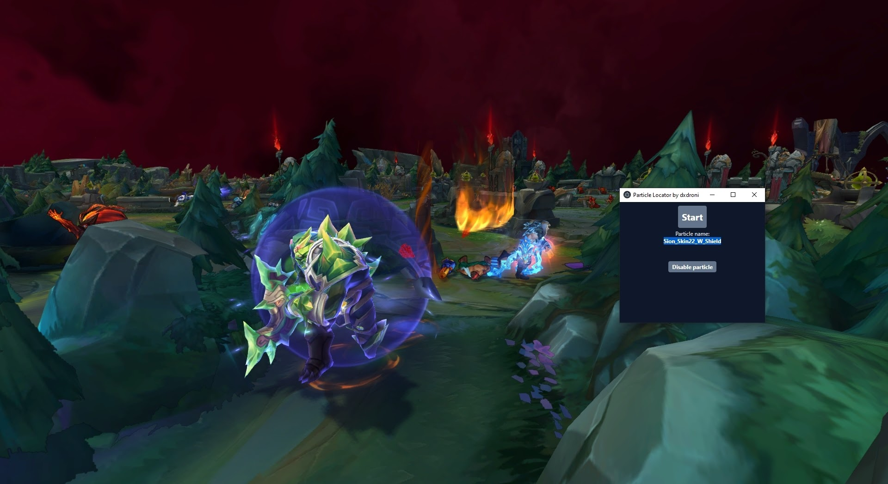
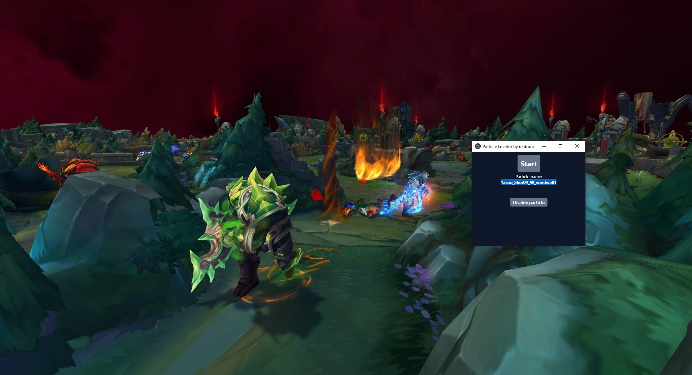
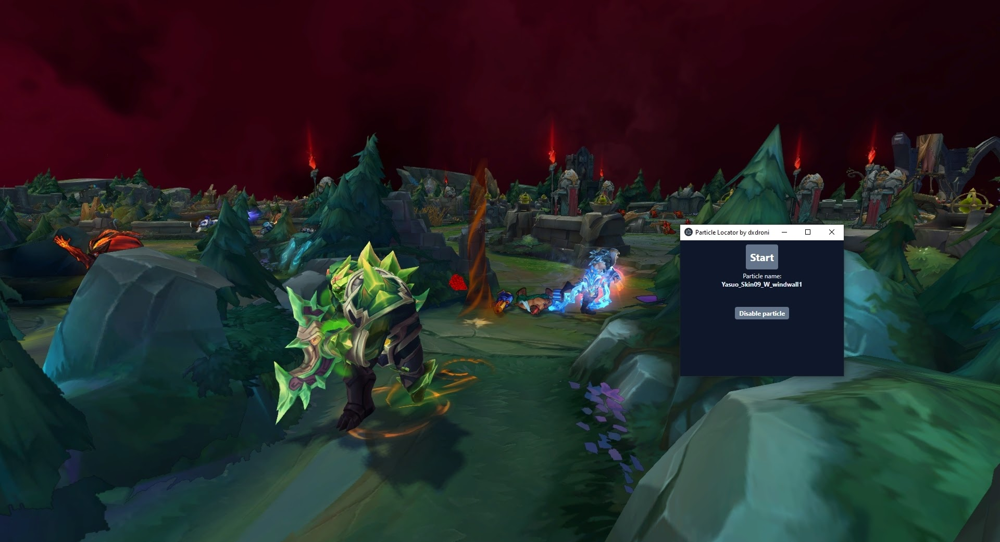
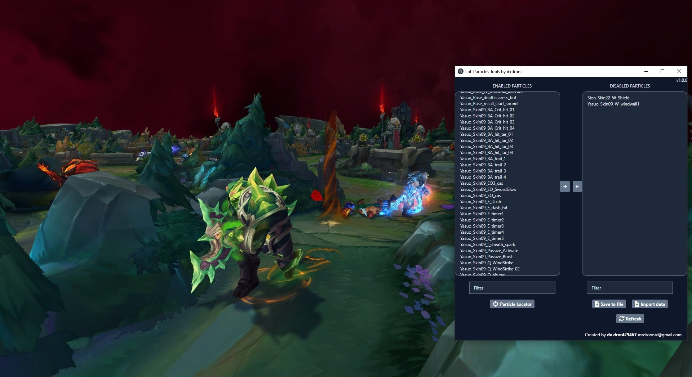

# lol-particle-tools

## Features

- locate particles fast
- disable particles from your own lists using text file

### How does it work

It simply makes requests to League of Legends Replay API locally.

### Particle Locator

Helps you find unwanted particle (name) and disable it

